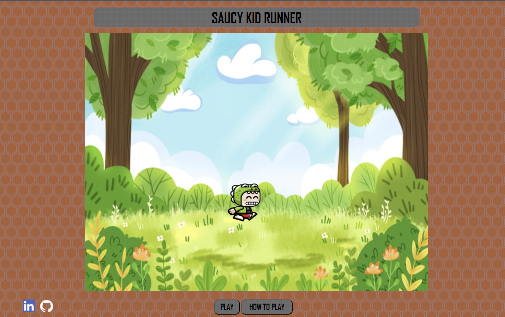

Overview/Description of Project
Live Link to the hosted project
Screenshots/GIFs of project features
1-2 Code Snippets showing something you did

# JavaScript Project 

The user can make the saucy kid on the screen run avoiding birds 
which appear on the screen. 

[play here](https://naokosugawara.github.io/JS_project/)

## Overview

The user can make the charactor on the screen run avoiding obstacles 
which appear on the screen. 
The game will show how far the caractor goes as it keeps running. 

## Functionality 

1. First, there are these features on the screen : 

   - start button
   - charactor 
   - horizontal line where the charactor run on
   - counter to show how many time the charactor hits the obstacles
   - score to show how far the charactor goes 

2. Once the user clicks the start button, the charactor starts running.

3. As the charactor keeps running, some obsticles will appear.  

4. To avoid each obstacle, the user must hit the space key to make the charactor jump.

5. When the charactor wasn't able to avoid the obstacle, it'll increase the counter by one 

6. Once the counter reaches 5, then it'll let the user know that game is over. 

**Bounus features** 

7. It has a form to put the user's name

8. It shows top 3 users who scored high 

### Wireframes

### Technologies, Libraries, APIs

Vanilla JS, HTML, CSS, Canvas

---

